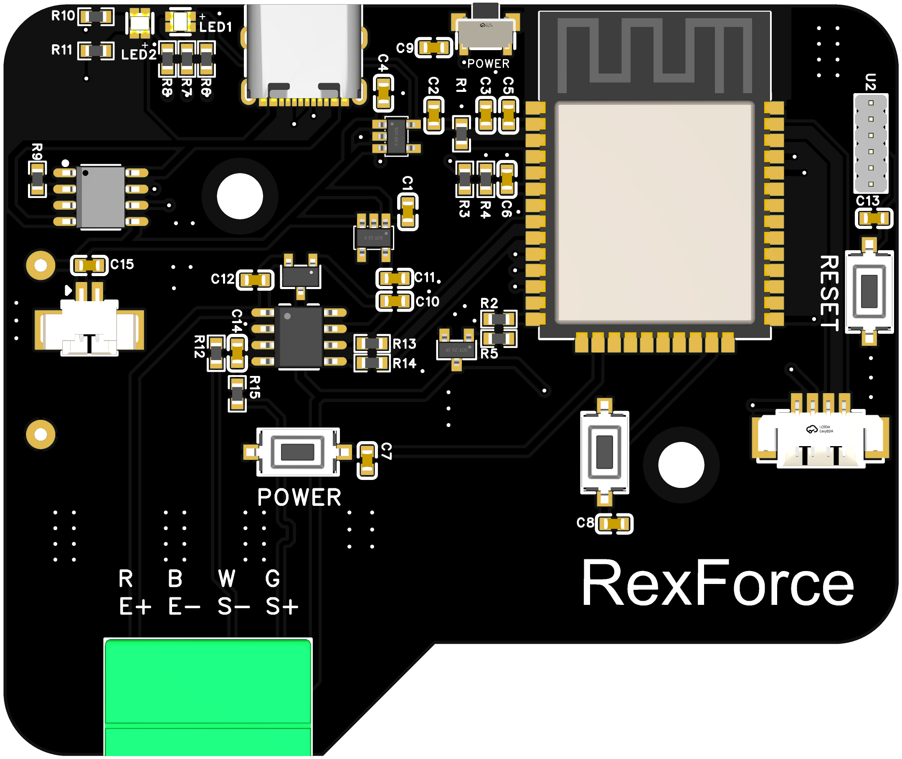
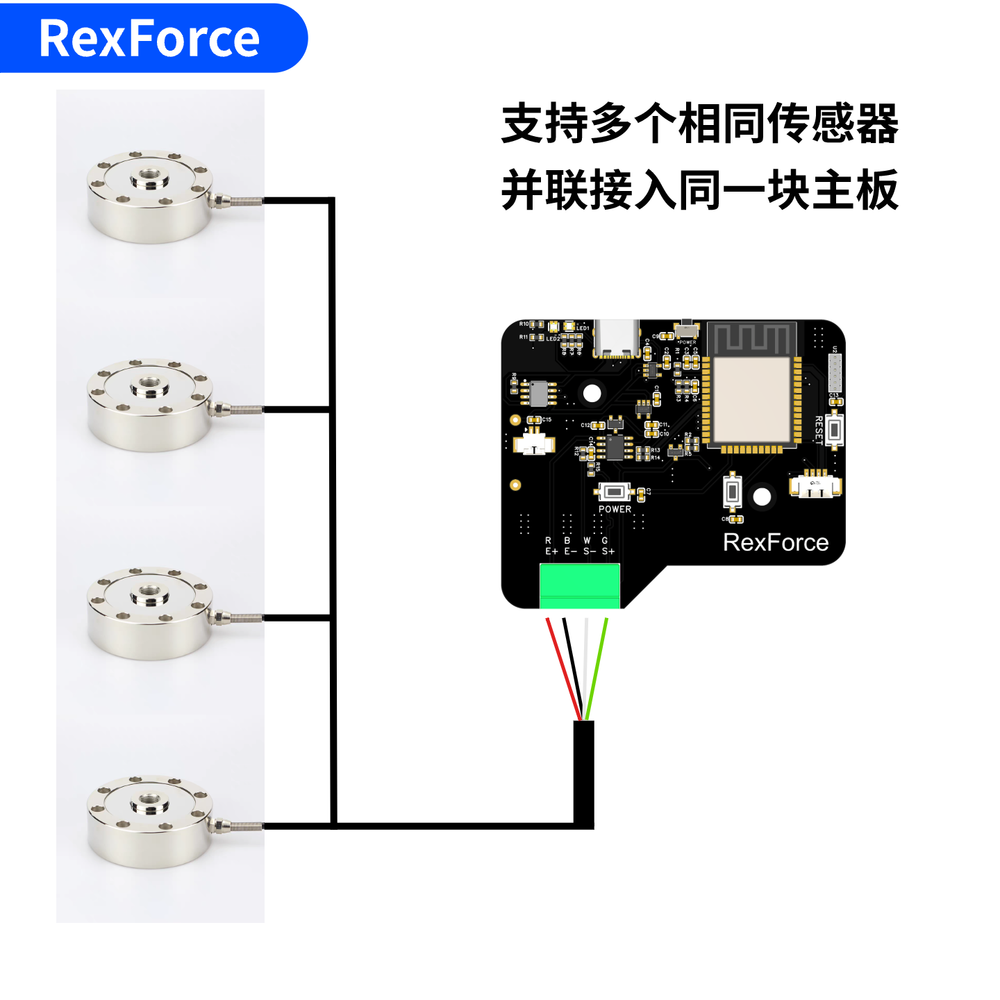
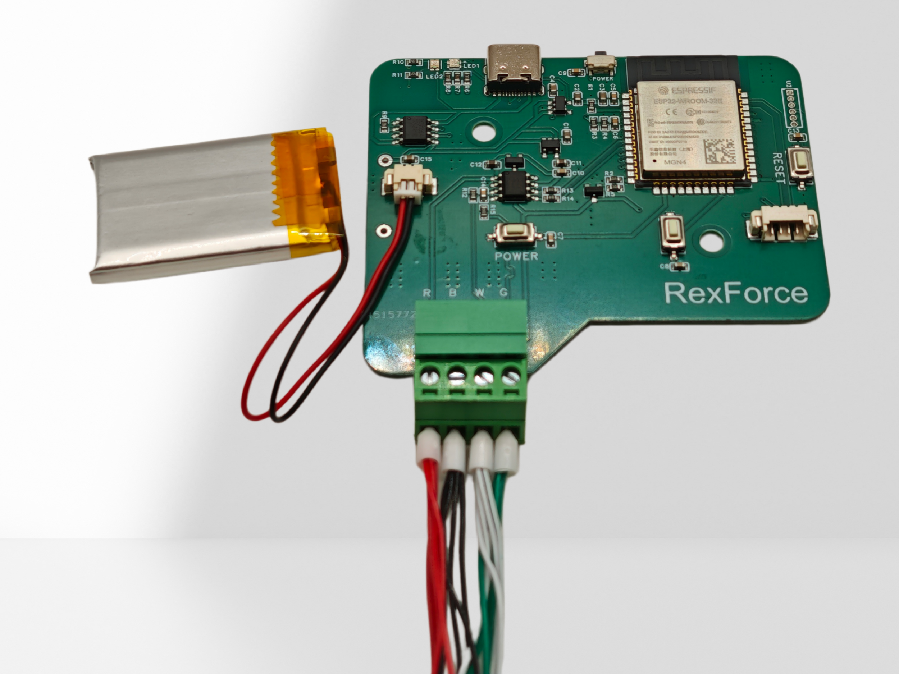
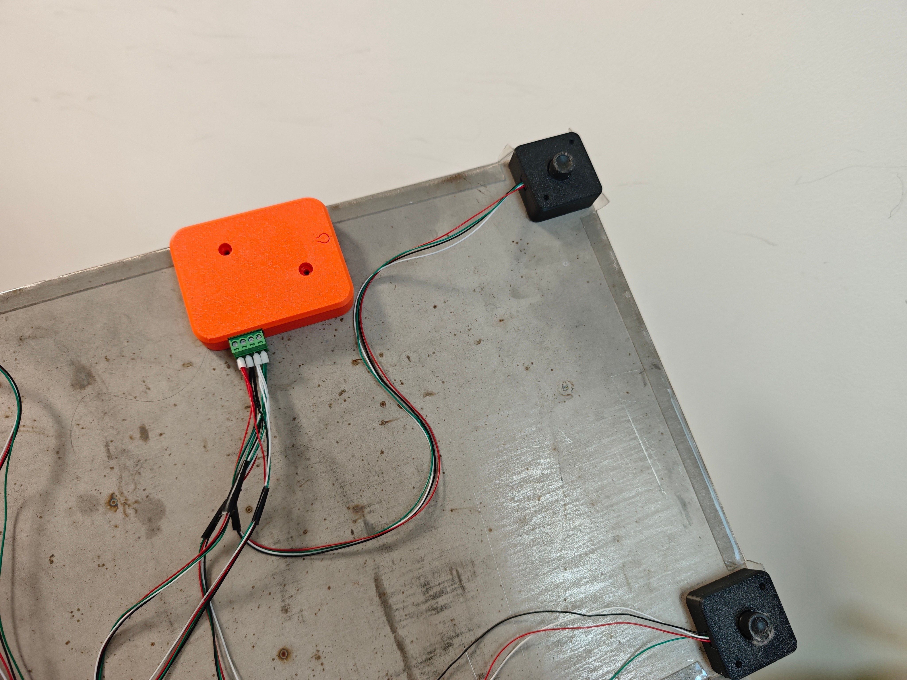

# RexForce测力主板开发说明文档

## 目录
1. [设备概述](#1-设备概述)
2. [测力传感器接线](#2-测力传感器接线)
3. [电池说明](#3-电池说明)
4. [设备操作与指示](#4-设备操作与指示)
5. [连接方式](#5-连接方式)
6. [通信协议](#6-通信协议)
7. [客户端开发指南](#7-客户端开发指南)
8. [归零校准操作](#8-归零校准操作)
9. [注意事项](#9-注意事项)
10. [主板尺寸图](#10-主板尺寸图)
11. [应用程序](#11-应用程序)
12. [示例：简易测力台采购装配教程](采购装配/README.md)

---

## 1. 设备概述
### 1.1 设备定义
RexForce 测力主板是一款用于测力采集与无线传输的控制主板，可连接各类测力传感器，用于制造运动测力台、肌力测试仪、力量评估设备、康复评估设备、平衡测试平台等运动与康复类设备，以及工业测力计、拉压力测试机、吊装测力装置、工装夹具测力装置、智能称重终端等工业类设备。

### 1.2 功能说明
设备提供 **BLE 蓝牙** 连接，支持手机、平板、带蓝牙功能的电脑等客户端接入，并以 **1000 Hz** 采样速率实时输出重量数据，适用于测力采集、数据显示与无线传输等应用场景。

### 1.3 工作模式
设备支持以下工作模式：
- **单机模式**：仅发送主设备重量数据。
- **双机模式**：将有线连接的主设备与副设备的重量数据合并发送。

### 1.4 主板参数
| 项目 | 参数 |
| --- | --- |
| 型号 | RexForce |
| 无线连接 | BLE 蓝牙 |
| 通讯协议 | BLE GATT + 私有应用层数据协议 |
| 采样速率 | 1000 Hz |
| 支持模式 | 单机模式、双机模式 |
| 适配传感器 | 四线全桥应变式测力传感器 |
| 测量范围 | ±3276.8 kg（拉力、压力） |
| 数据分辨率 | 0.1 kg |
| ADC 分辨率 | 24 位 |
| 测量精度 | 与所配传感器、机械结构及标定结果有关 |
| 通讯距离 | 10 ~ 50 m（与现场环境及客户端设备有关） |
| 工作温度范围 | -40℃ ~ 85℃（视整机配置与使用环境而定） |
| 电池类型 | 3.7 V 可充电锂电池 |
| 运行功耗 | 0.4 W |
| 传感器接口 | 插拔式 3.81 mm 接线端子 |

<p align="center">
  
</p>

---

## 2. 测力传感器接线
### 2.1 适用传感器类型
主板适用于 **四线全桥应变式测力传感器**，接口定义为 `E+`、`E-`、`S+`、`S-`。

<sub>部分传感器带屏蔽线（5 线制），其中屏蔽线不接入 `E+`、`E-`、`S+`、`S-` 端子。</sub>

半桥传感器应先通过桥路补偿或加秤板转换为标准四线桥式输出后，再接入主板。

<p align="center">
  
</p>

### 2.2 接线端子定义
测力传感器接线端子共 4 个，定义如下：

| 端子 | 说明 |
| --- | --- |
| `E+` | 激励正 |
| `E-` | 激励负 |
| `S+` | 信号正 |
| `S-` | 信号负 |

接线时，应将传感器对应引线分别接入 `E+`、`E-`、`S+`、`S-` 端子。

### 2.3 多个测力传感器接入
支持多个相同传感器并联接入同一块主板。

例如：将 4 个测力传感器安装于金属板四角，并联接入一块主板，组成测力台。

并联接入时，各传感器端子定义应保持一致：

- 所有 `E+` 并接至主板 `E+`
- 所有 `E-` 并接至主板 `E-`
- 所有 `S+` 并接至主板 `S+`
- 所有 `S-` 并接至主板 `S-`

<p align="center">
  
</p>

<p align="center">
  
</p>

---

## 3. 电池说明
设备使用 **3.7 V 可充电锂电池** 供电。

电池接口必须使用 **1.25 红黑插头**，不得使用其他规格插头直接接入。

接线前应确认电池极性与插头规格一致。

### 3.1 充电说明
设备内置锂电池充电管理电路。

典型充电电流约为 **1000 mA**。

充电输入建议使用稳定的 **5 V** 电源。

为保证电池寿命与充电安全，建议配套使用单节 **3.7 V 锂电池**，并避免在高温、受压、破损或进水环境下充电。

设备运行过程中如同时充电，实际充电电流可能因系统负载而下降，充满时间也会相应延长。

---

## 4. 设备操作与指示
### 4.1 开关机
#### 开机
长按电源键，绿灯亮起后设备启动。启动后设备自动归零，归零期间请勿在测量面放置重物。

#### 关机
长按电源键，LED 红灯亮起后熄灭，设备关机。

### 4.2 按键操作
#### 电源键（功能键）
| 操作 | 效果 |
| --- | --- |
| 短按 | 切换连接模式：BLE ↔ 有线 |
| 长按 | 开关机 |

- BLE 已连接时，短按切换无效，应先断开蓝牙连接。
- 切换至 BLE 模式时，LED 蓝色闪烁 1 秒；切换至有线模式时，LED 青色闪烁 1 秒。确认后恢复显示电量状态。
- 2 秒内重复短按无效（防抖）。

#### 复位键
复位键用于设备复位。

### 4.3 电量显示
| 电量状态 | LED 颜色 |
| --- | --- |
| 充足 | 绿色 |
| 中等 | 黄色 |
| 低 | 红色 |

---

## 5. 连接方式
### 5.1 BLE 蓝牙连接（默认）
- 设备上电后自动广播 BLE，名称格式为 `Force-XXXX`，其中 `XXXX` 为设备唯一 ID 后 4 位。
- 客户端扫描并连接对应设备，无需配对码。
- 设备处于待连接状态时，LED 以 500 ms 间隔闪烁。
- 连接建立后，设备立即开始推送数据，LED 切换为常亮状态。
- 建议连接后协商 MTU ≥ 244 字节。

### 5.2 有线连接（仅限双机互联）
- 有线模式仅用于主设备与副设备之间的数据传输，不支持直接连接电脑客户端。
- 使用双 Type-C 数据线连接两台设备，其中一台切换为有线模式作为副设备，另一台保持 BLE 模式作为主设备。
- 主设备建立蓝牙连接后自动检测副设备连接状态；检测到副设备后，自动进入双机模式。
- 双机模式下，副设备将重量数据发送给主设备；主设备整合两设备数据后，推送给客户端，客户端按 `6.2` 节格式解析即可。
- 切换至有线模式后，LED 青色闪烁 1 秒确认，随后切换为常亮状态。
- 串口参数：波特率 `921600 bps`，格式 `8N1`。

---

## 6. 通信协议
### 6.1 BLE GATT 服务信息
| 项目 | UUID |
| --- | --- |
| 服务 UUID | `0000FFE5-0000-1000-8000-00805F9A34FB` |
| TX 特征（设备→客户端，Notify） | `0000FFE4-0000-1000-8000-00805F9A34FB` |
| RX 特征（客户端→设备，Write） | `0000FFE9-0000-1000-8000-00805F9A34FB` |

---

### 6.2 设备 → 客户端：数据帧格式
#### BLE 模式：固定 244 字节帧
```plain
字节位置    长度    含义
[0]         1      帧头 SLAVE，固定 0x01
[1]         1      功能码 FUNC，见下表
[2~3]       2      首个数据点时间戳（大端，单位 ms，对 65535 取余循环）
[4~243]     240    重量数据区
```

##### 功能码（FUNC）
| FUNC 值 | 模式 | 数据区含义 |
| --- | --- | --- |
| `0x03` | 单机 | 240 字节 = 80 个数据点 × 3 字节/点 |
| `0x05` | 双机 | 240 字节 = 40 组数据 × 6 字节/组（主设备 3 字节 + 副设备 3 字节） |

##### 单机模式数据区（FUNC = 0x03）
每个重量点占 3 字节：

```plain
[HIGH_BYTE] [LOW_BYTE] [CHECKSUM]
```

+ `HIGH_BYTE + LOW_BYTE`：大端有符号 16 位整数，值 = 重量(kg) × 10。
+ 数值正负表示受力方向；通常可对应压力与拉力，具体含义取决于传感器类型及安装方式。
+ 示例：`0x00 0x7B` → 123 → 12.3 kg；`0xFF 0x85` → -123 → -12.3 kg。
+ 表示范围：-3276.8 ~ +3276.7 kg。
+ `CHECKSUM = (HIGH_BYTE + LOW_BYTE) & 0xFF`，校验失败时该点应丢弃。

**Python 解码示例：**

```python
def decode_point(high, low, checksum):
    if (high + low) & 0xFF != checksum:
        return None  # 校验失败，丢弃
    val = (high << 8) | low
    if val >= 32768:
        val -= 65536  # 有符号处理
    return val / 10.0  # 单位：kg
```

##### 双机模式数据区（FUNC = 0x05）
每组数据占 6 字节，分别表示主设备和副设备各 1 个重量点：

```plain
[主设备 HIGH] [主设备 LOW] [主设备 CHECKSUM] [副设备 HIGH] [副设备 LOW] [副设备 CHECKSUM]
```

+ 前 3 字节为主设备重量，解码方式同上。
+ 后 3 字节为副设备重量，解码方式同上。
+ 副设备数据若为 `0x00 0x00 0x00`，其解码结果为 0.0 kg，不应直接视为无数据。
+ 合力 = 主设备重量 + 副设备重量。

##### 数据帧示例

###### 示例 1：单机模式帧头 + 前 3 个数据点

```plain
01 03 12 34  00 7B 7B  FF 85 84  00 11 11  ...（后续补满 240 字节数据区）
```

说明：

+ `01`：帧头 `SLAVE = 0x01`
+ `03`：功能码 `FUNC = 0x03`，表示单机模式
+ `12 34`：首个数据点时间戳 = `0x1234` = 4660 ms
+ 第 1 个点 `00 7B 7B`：原始值 `0x007B` = 123，重量 12.3 kg，校验正确
+ 第 2 个点 `FF 85 84`：原始值 `0xFF85` = -123，重量 -12.3 kg，校验正确
+ 第 3 个点 `00 11 11`：原始值 `0x0011` = 17，重量 1.7 kg，校验正确

###### 示例 2：双机模式帧头 + 前 2 组数据

```plain
01 05 00 50  00 3D 3D  00 1B 1B  FF C9 C8  00 09 09  ...（后续补满 240 字节数据区）
```

说明：

+ `01`：帧头 `SLAVE = 0x01`
+ `05`：功能码 `FUNC = 0x05`，表示双机模式
+ `00 50`：首个数据点时间戳 = `0x0050` = 80 ms
+ 第 1 组 `00 3D 3D  00 1B 1B`：主设备 6.1 kg，副设备 2.7 kg，合力 8.8 kg
+ 第 2 组 `FF C9 C8  00 09 09`：主设备 -5.5 kg，副设备 0.9 kg，合力 -4.6 kg

###### 示例 3：校验失败的数据点

```plain
00 7B 7C
```

+ 该点原始值为 `0x007B`，即 123 → 12.3 kg。
+ 正确校验应为 `(0x00 + 0x7B) & 0xFF = 0x7B`。
+ 实际收到 `0x7C`，说明校验失败，客户端应丢弃该点。

##### 时间戳说明
+ 字节 `[2~3]` 为该帧第一个数据点的采集时间戳（ms），大端无符号 16 位。
+ 取值范围为 0~65534，对 65535 取余循环，约每 65 秒归零一次。
+ 相邻帧时间戳理论差值约为 80 ms，可用于检测丢帧。

---

### 6.3 客户端 → 设备：控制指令
通过 **BLE RX 特征 Write** 发送以下字节序列：

| 指令 | 字节序列 | 长度 | 说明 |
| --- | --- | --- | --- |
| 恢复默认比例系数 | `0x54 0xF8` | 2 | 将比例系数恢复为默认值 |
| 保存当前为默认值 | `0x54 0xCC` | 2 | 将当前比例系数保存为默认值 |
| 请求温度原始值 | `0x54 0xDD` | 2 | 设备回传温度响应（见 6.4 节） |
| 主动断开 BLE 连接 | `0x54 0xDE` | 2 | 设备主动断开当前 BLE 连接，并回到可广播状态 |
| 发送校准因子 | `0x54 0xAA` + 4 字节大端整数 | 6 | 校准比例系数 |

#### 主动断开指令
向 BLE RX 特征写入 `0x54 0xDE` 后，设备会主动断开当前 BLE 连接。

适用场景：

+ 远程触发设备断连。
+ 切换设备、重新扫描或重连测试前，使设备先回到待连接状态。

发送成功后：

+ 当前 BLE 连接断开。
+ 设备重新进入广播状态，可再次扫描并重连。

#### 校准因子指令
校准因子 = 当前测量值 ÷ 标准砝码值；放大 10000 倍后，以 4 字节大端无符号整数发送。

**示例**：标准砝码值 5.00 kg，当前测量值 5.23 kg：

```python
import struct
standard_weight_kg = 5.00
measured_kg = 5.23
factor = measured_kg / standard_weight_kg   # ≈ 1.046
factor_int = int(round(factor * 10000))     # = 10460
cmd = bytes([0x54, 0xAA]) + struct.pack('>I', factor_int)
# 发送 cmd（共 6 字节）到 BLE RX 特征
```

设备收到后立即更新比例系数并持久化保存，无需重启。

---

### 6.4 设备 → 客户端：温度响应帧
客户端发送温度请求指令后，设备通过 **TX 特征 Notify** 回传：

```plain
[0x54] [0xDD] [B3] [B2] [B1] [B0]   共 6 字节
```

+ `B3~B0` 为温度原始值，采用大端有符号 32 位整数。

```python
import struct
raw_temp = struct.unpack('>i', bytes([B3, B2, B1, B0]))[0]
```

温度需经单点校正后换算，公式如下：

```plain
T_B(°C) = Yb × (273.15 + T_A) / Ya - 273.15
```

| 变量 | 含义 |
| --- | --- |
| `T_A` | 已知参考温度点（°C） |
| `Ya` | 在 `T_A` 下读取的原始码值 |
| `Yb` | 待测温度点读取的原始码值 |
| `T_B` | 换算后的实际温度（°C） |

使用方法：

1. 在已知温度 `T_A` 下读取一次原始值 `Ya`，作为校正基准。
2. 后续读取原始值 `Yb` 后，按公式计算实际温度。

**Python 示例：**

```python
# 校正基准（在已知温度 T_A=25°C 时读取一次 Ya）
T_A = 25.0
Ya  = 基准码值  # 在 25°C 下实测读取

# 后续测量
Yb  = raw_temp  # 当前读取的原始值
T_B = Yb * (273.15 + T_A) / Ya - 273.15
print(f"温度: {T_B:.2f} °C")
```

---

## 7. 客户端开发指南
### 7.1 BLE 连接示例（Python）
```python
# 推荐使用 bleak 库（跨平台）
# pip install bleak

import asyncio
from bleak import BleakScanner, BleakClient

TX_UUID = "0000FFE4-0000-1000-8000-00805F9A34FB"  # Notify（接收数据）
RX_UUID = "0000FFE9-0000-1000-8000-00805F9A34FB"  # Write（发送指令）

async def main():
    devices = await BleakScanner.discover(timeout=5.0)
    target = next((d for d in devices if d.name and d.name.startswith("Force-")), None)
    if not target:
        print("未找到设备")
        return

    async with BleakClient(target.address) as client:
        print(f"已连接: {target.name}")

        buf = bytearray()

        def on_notify(sender, data):
            buf.extend(data)
            while len(buf) >= 244:
                if buf[0] == 0x01 and buf[1] in (0x03, 0x05):
                    frame = bytes(buf[:244])
                    del buf[:244]
                    parse_frame(frame)
                else:
                    del buf[0]

        await client.start_notify(TX_UUID, on_notify)
        await asyncio.sleep(10)
        await client.stop_notify(TX_UUID)

asyncio.run(main())
```

### 7.2 完整帧解析示例
```python
FRAME_LEN      = 244
DATA_FIELD_LEN = 240

def decode_point(high, low, checksum):
    """解码 3 字节重量点，校验失败返回 None。"""
    if (high + low) & 0xFF != checksum:
        return None
    val = (high << 8) | low
    if val >= 32768:
        val -= 65536
    return val / 10.0

def parse_frame(frame: bytes):
    slave = frame[0]   # 0x01
    func  = frame[1]   # 0x03 单机 / 0x05 双机
    ts_ms = (frame[2] << 8) | frame[3]  # 首样时间戳 ms

    if func == 0x03:  # 单机模式
        for i in range(0, DATA_FIELD_LEN, 3):
            w = decode_point(frame[4+i], frame[5+i], frame[6+i])
            if w is not None:
                print(f"  ts={ts_ms}ms  weight={w:.1f} kg")

    elif func == 0x05:  # 双机模式
        for i in range(0, DATA_FIELD_LEN, 6):
            local = decode_point(frame[4+i], frame[5+i], frame[6+i])
            remote = decode_point(frame[7+i], frame[8+i], frame[9+i])
            if local is not None and remote is not None:
                combined = local + remote
                print(f"  ts={ts_ms}ms  主设备={local:.1f}  副设备={remote:.1f}  合力={combined:.1f} kg")
```

### 7.3 指令发送示例
```python
import struct

# 恢复默认比例系数
await client.write_gatt_char(RX_UUID, bytes([0x54, 0xF8]))

# 保存当前比例系数为默认值
await client.write_gatt_char(RX_UUID, bytes([0x54, 0xCC]))

# 请求温度原始值
await client.write_gatt_char(RX_UUID, bytes([0x54, 0xDD]))

# 主动断开 BLE 连接
await client.write_gatt_char(RX_UUID, bytes([0x54, 0xDE]))

# 发送校准因子（标准砝码值 standard_weight_kg，当前测量值 measured_kg）
standard_weight_kg = 5.00
measured_kg = 5.23
factor_int = int(round((measured_kg / standard_weight_kg) * 10000))
cmd = bytes([0x54, 0xAA]) + struct.pack('>I', factor_int)
await client.write_gatt_char(RX_UUID, cmd)
```

---

## 8. 归零校准操作
制作好测力设备后，必须先使用**精确砝码**进行校准。

1. 完成设备安装与传感器接线后，确认机械结构已固定，测量面无额外载荷。
2. 给设备上电，等待主板自动归零完成；归零期间请勿在测量面放置重物。
3. 选择稳定、精确的标准砝码，且砝码重量应尽量接近设备的实际使用区间，不宜过小。
4. 例如：如设备平时测量范围在 `0 ~ 30 kg`，优先使用 `10 kg` 或 `20 kg` 标准砝码进行校准；如仅使用 `1 kg` 小砝码，分辨率影响和误差更容易被放大。
5. 将标准砝码放置到规定受力位置，读取当前显示值，按“**读取显示值 ÷ 标准砝码值**”计算校准因子，并按 `6.3` 节的方法发送校准命令。
6. 建议完成单点校准后，再进行 `2 ~ 3` 个点的加载验证。例如：归零后依次测试 `5 kg`、`10 kg`、`20 kg`，检查各点显示值是否均接近真实值。
7. 如出现某一个点显示准确、而其他点偏差明显较大的情况，则问题可能不只是比例系数，还可能与机械结构受力不均、传感器非线性、安装方式或程序滤波 / 清零逻辑有关。
8. 校准完成后，移除砝码并再次检查空载零点及加载显示是否正常。

---

## 9. 注意事项
1. **MTU 协商**：建议连接后协商 MTU ≥ 244 字节。设备默认 MTU 为 400。
2. **校验处理**：每个数据点均包含 1 字节校验和；校验失败时应直接丢弃，不应补零。
3. **时间戳环绕**：时间戳约每 65 秒归零一次，客户端应处理环绕。
4. **双机 0 值**：副设备三字节为 `0x00 0x00 0x00` 时，其解码结果为 `0.0 kg`，不应直接视为无数据。
5. **开机归零**：开机自动归零期间请勿放置重物，以免零点偏移。
6. **模式切换限制**：BLE 已连接时不能切换模式，需先断开蓝牙连接。
7. **设备命名**：BLE 广播名称格式为 `Force-XXXX`，其中 `XXXX` 为芯片 ID 后 4 位。
8. **校准生效**：发送校准因子后立即生效，并自动保存。
9. **有线模式范围**：有线模式仅用于两台 RexForce 主板互联，不支持直接连接电脑客户端。

---

## 10. 主板尺寸图

<p align="center">
  
</p>

---

## 11. 应用程序

### 11.1 示例 Python 程序
文档中提供的示例 Python 程序可作为上位机接入参考，用于演示 RexForce 测力主板的 BLE 扫描、设备连接、数据接收、帧解析及指令发送等基础开发流程。

该程序可实现以下功能：

1. 扫描并连接 `Force-XXXX` 设备。运行程序前，应确保电脑具备 BLE 功能，且 RexForce 主板已正常启动状态；
2. 建立连接后，接收并处理主板上传的数据，同时可发送常用控制指令，如读取温度、发送校准因子、恢复默认比例系数及断开连接；
3. 测试过程中可记录原始数据，并在测试结束后保存为 Excel 文件；
4. 可作为上位机软件开发的基础通信示例，供开发者进一步扩展数据采集、测试控制、结果显示、数据记录与业务集成等功能。

### 11.2 微信小程序：体能训练追踪Lab
`体能训练追踪Lab` 是一款可与 RexForce 测力主板配套使用的微信小程序，适用于基于本主板构建的肌力测试设备与测力台设备的数据采集、测试执行与结果查看。

根据所连接传感器数量及整机形态的不同，小程序可支持以下典型应用方式：

- **肌力测试应用**：当主板连接 **1 个拉力传感器** 时，设备可作为**肌力测力计**使用，用于开展相关肌力测试。
- **测力台应用**：当主板连接 **4 个压力传感器** 并集成为**测力台**后，可使用小程序中的测力台相关功能进行测试与数据分析。

### 11.3 开发者应用登记
欢迎用户基于 RexForce 测力主板，自行开发 App、上位机软件、微信小程序或其他相关应用。

如已完成相关应用开发，或正在开展基于本主板的应用方案设计，可将应用名称、主要功能及适用场景留言登记在此，便于后续整理与展示更多生态应用案例。

---

## 12. 示例：简易测力台采购装配教程

[点此查看简易测力台采购装配教程](采购装配/README.md)

<p align="center">
  
</p>

---

_文档版本：2026-04-12_
