# 基于RexForce主板的测力台零件采购与组装说明

[点击这里查看RexForce主板开发说明文档](../README.md)

[点击这里查看组装视频教程](https://www.bilibili.com/video/BV1iDtv6AEkH/?spm_id_from=333.1387.homepage.video_card.click&vd_source=62abb6fab9f91cdaa9f76e8942c84d40)

  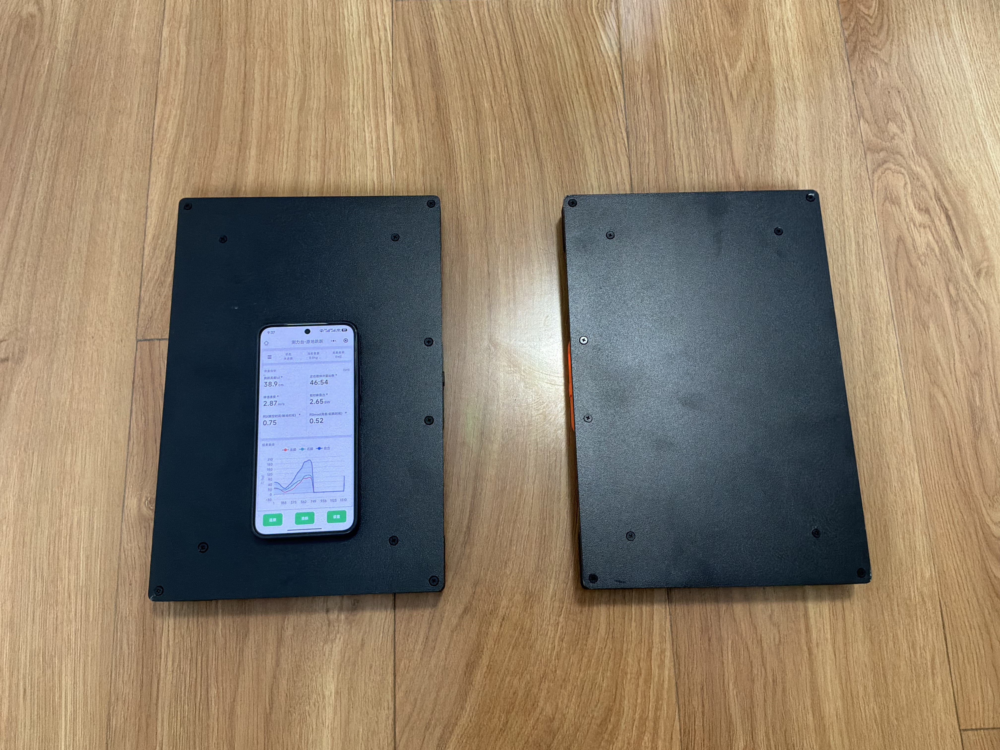

**以下是一块测力台的零件，如果要制作两块进行双脚测试，零件数量×2即可。**

## 1 工具

### 1.1 十字螺丝刀、一字螺丝刀

[【淘宝】绿林螺丝刀套装](https://e.tb.cn/h.imDQMPqkdzBjzan?tk=mr7W540cw6q)

### 1.2 鸭嘴剥线钳

[【淘宝】德力西剥线钳](https://e.tb.cn/h.im4mGovcTXpFgY3?tk=erW6540cWMN) 

### 1.3 标准砝码（可选）

> 日常使用可以用体重代替砝码，即人站上去用体重进行校准

[ 【淘宝】标准砝码](https://e.tb.cn/h.ioBJtIZrXX8hFKA?tk=fKoD5UCPU7m)

## 2 零件

### 2.1 RexForce测力主板1个

[【淘宝】RexForce测力主板](https://e.tb.cn/h.im4tIFMHybAbLcZ?tk=U6I85407mQf) 

### 2.2 锂电池1个

[【淘宝】3.7V聚合物锂电池](https://e.tb.cn/h.im4aTgAbRC0qc8I?tk=jRqv54Zn69S) 

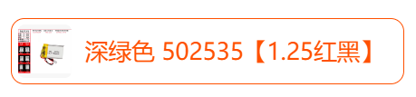

### 2.3 测力传感器4个

[【淘宝】测力传感器](https://e.tb.cn/h.iJ1PV9ClVYTvE5E?tk=cuvu5ScJeLK) 

 

>单个传感器200kg量程，四个800kg。如果200kg缺货，用100kg的也可以。要跟客服确认线多长，装在钢板上长度是否足够。4个传感器必须用相同型号、量程、灵敏度等，要匹配。

### 2.4 秤脚

[【淘宝】带胶垫 28-M5×9 10套](https://e.tb.cn/h.R7ve028RES5DzhJ?tk=9AIrgZ0T8Fr) 

  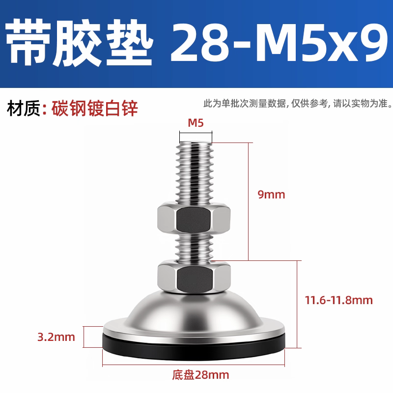

### 2.5 外壳3D打印1套

>联系淘宝客服，将下载好的 `3D打印文件.3mf` 文件发给客服，打印即可。可以联系客服自己选颜色和材料。

[【淘宝】3D打印服务](https://e.tb.cn/h.inaKN3jBCLKEbqG?tk=2rhw54ZtYiK) 

  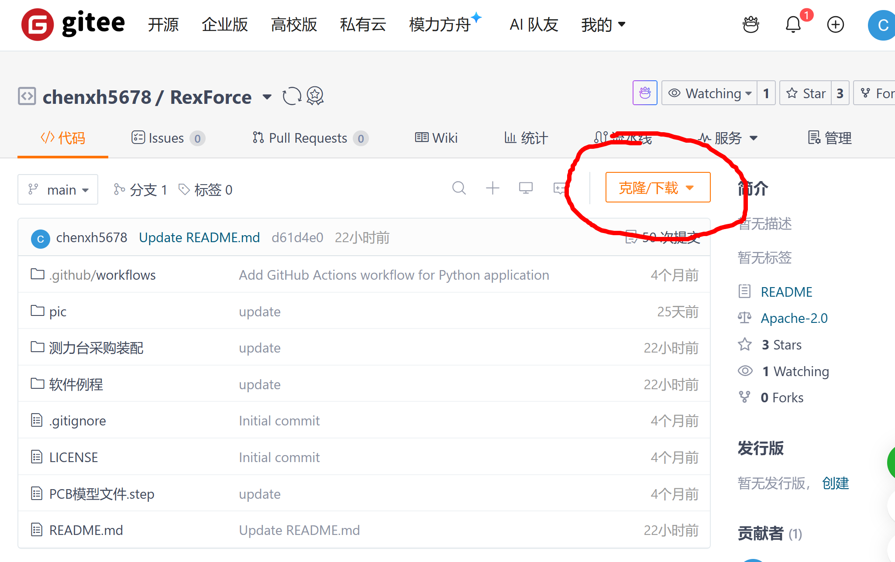

### 2.6 钢板定制1块

> 钢板螺丝孔图纸可以用下载的文件夹中的'350×250mm钢板定制图纸.dwg'，厚度5mm以上

[【淘宝】不锈钢板激光切割](https://e.tb.cn/h.inasCLNXotgxqqC?tk=UrEN54ZE8SY) 

### 2.7 M3螺丝2~20个

[【淘宝】M3黑色不锈钢螺丝](https://e.tb.cn/h.iOpqxURZDhgB21X?tk=pOpC540gd3P) 

### 2.8 接线端子1个

[【淘宝】KF2EDG PCB接线端子](https://e.tb.cn/h.imfXjrMu2owpwlC?tk=r0nq540qWOY) 

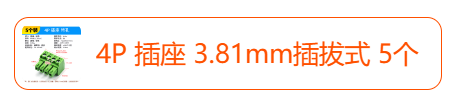

### 2.9 屏蔽胶带铝箔胶带

[【淘宝】宽50MM*20米足长](https://e.tb.cn/h.RVo3PtKf2AzqXts?tk=mpx05vANGBk) 

### 2.10 双头Type-C数据线1根

[【淘宝】双Type-C数据线](https://e.tb.cn/h.iOpiUHw1WF56L72?tk=ZHzF54ZzYl2) 

> 用来连接两个测力台，只有一个测力台可不用数据线。

### 2.11 充电器1个（可选）

[【淘宝】PD5V1A慢充头 C口](https://e.tb.cn/h.8URQUFbLXy8JXVJ?tk=6W0ngBd6Cdv) 

### 2.12 串口模块1个（可选）

> 用于有线连接电脑使用，数据传输更稳定更快，只连蓝牙使用不需要串口模块

[【淘宝】串口模块rexforce测力台有线连接电脑](https://e.tb.cn/h.89pQIGLGLaeGpYd?tk=PlstTWyI0Gy) 

---

## 3 装配
### 3.1 传感器剥线
用鸭嘴钳将所有测力传感器的四根线末端剥出约1cm长的金属线.

  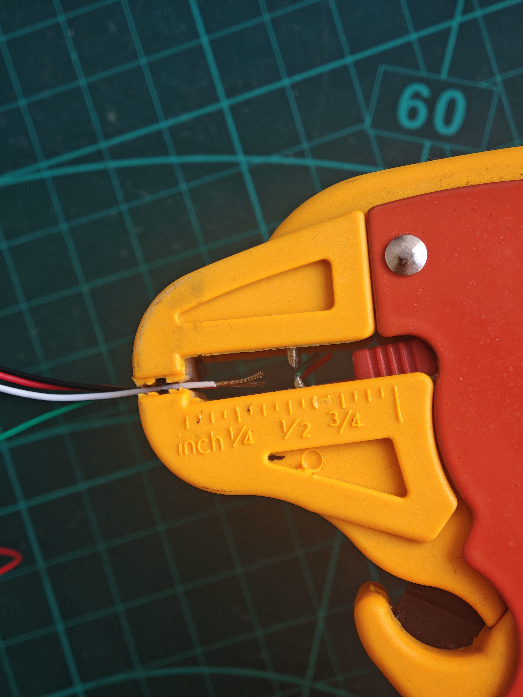

然后将相同颜色的金属线部分拧到一起，拧好后像图中平直，勿弯折回勾等形状

  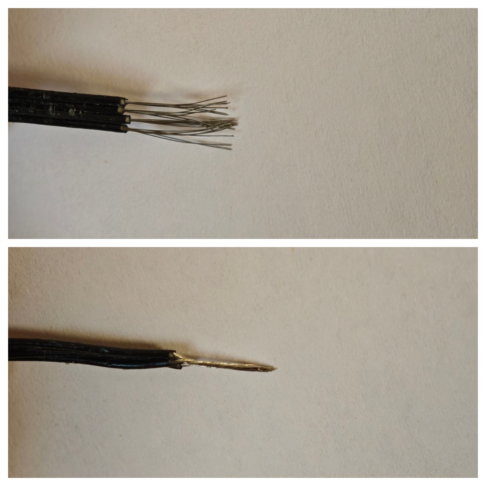

最后按红、黑、绿、白（或红、黑、白、绿）顺序插到接线端子里，用螺丝刀拧紧固定好。

>绿线、白线位置影响测力的方向，数值正或负，根据实际传感器情况进行调整

  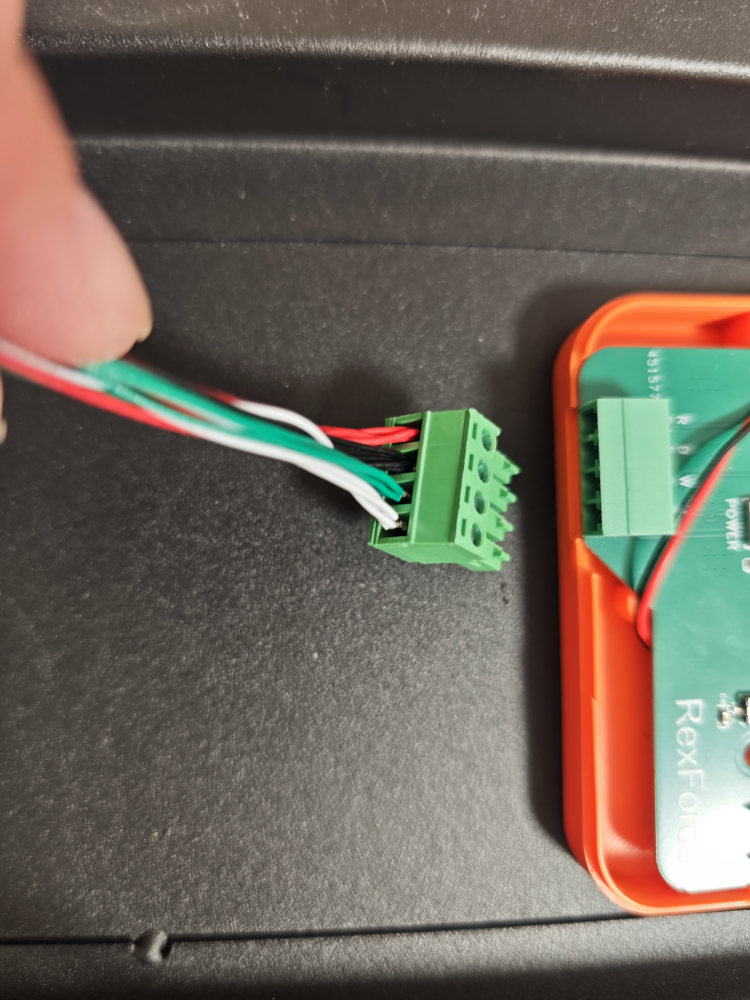

### 3.2 安装
如图插电池，插接线端子，装外壳。

  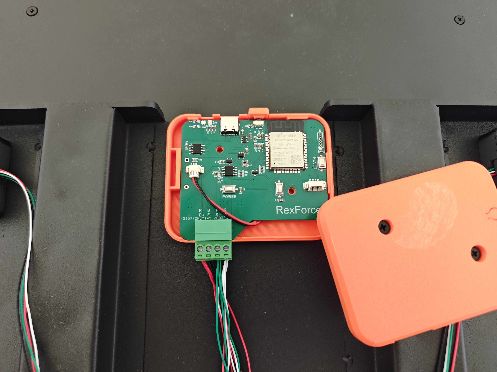

秤脚加上盖子后，加螺母扣拧到传感器上。（图中为方便演示没加盖子）

  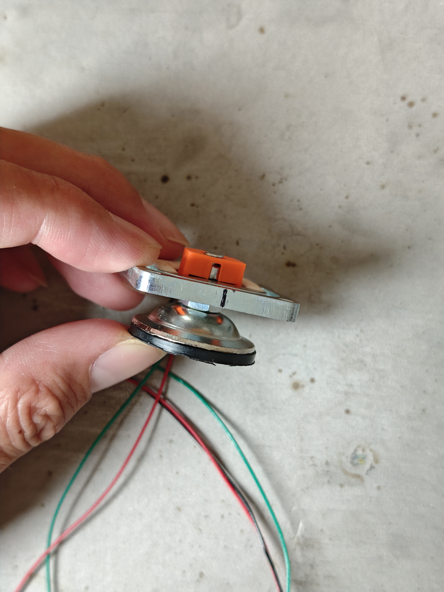

### 3.3 装钢板
用螺丝把四个传感器拧到钢板四角，然后将主机固定到钢板底部边缘。

> 

  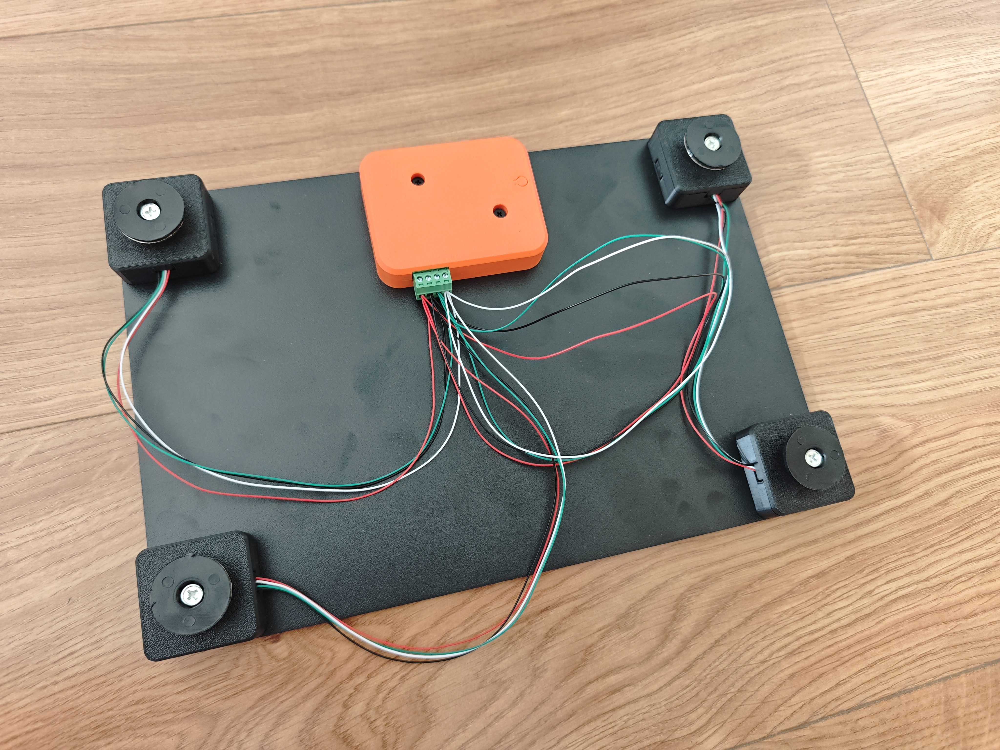

### 3.4 贴屏蔽胶带
用屏蔽胶带将传感器的线贴到钢板上，将线盖严充分屏蔽外界电磁干扰

  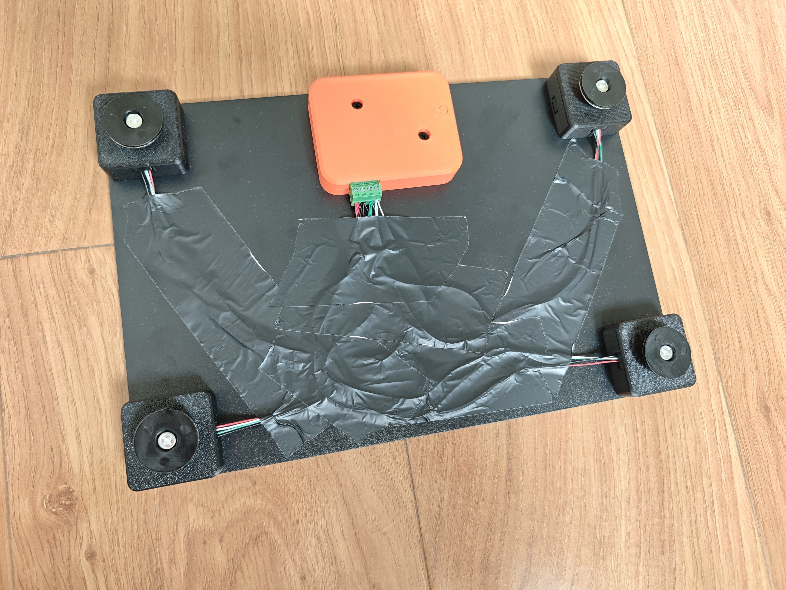

## 4 微信小程序
装配完成后，软件能正常读取重量数据后，如果发现称重与体重不一致，就用体重或精确砝码进行**校准标定**，可以用例程或微信小程序进行校准标定操作。

>详情查看《RexForce测力主板开发说明文档》8. 归零校准操作

开机连接微信小程序《体能训练追踪Lab》，可以进行跳跃测试、等长肌力测试等。

## 5 销售问题
鼓励大家自己贴牌销售，无需告知开发者。

>如销售产生纠纷，需自行担责

在购买电路板时可联系商家修改设备BLE名称，让设备只能接入您的APP

---