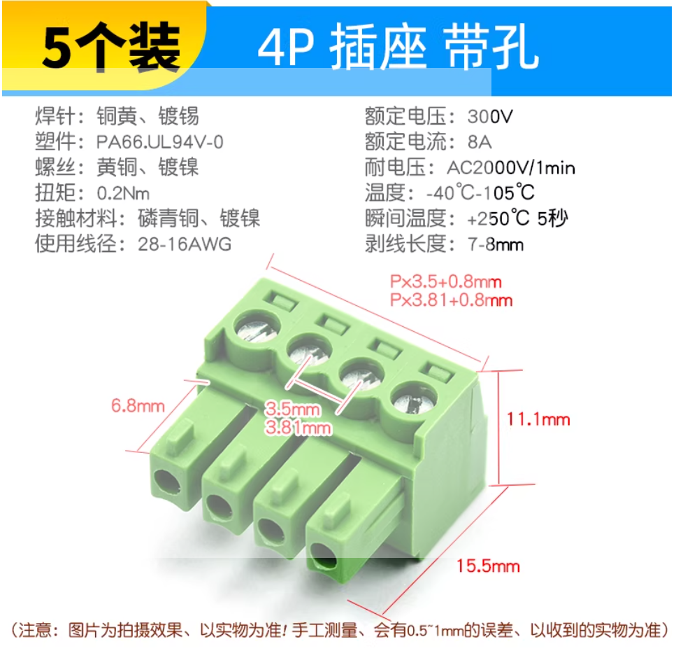
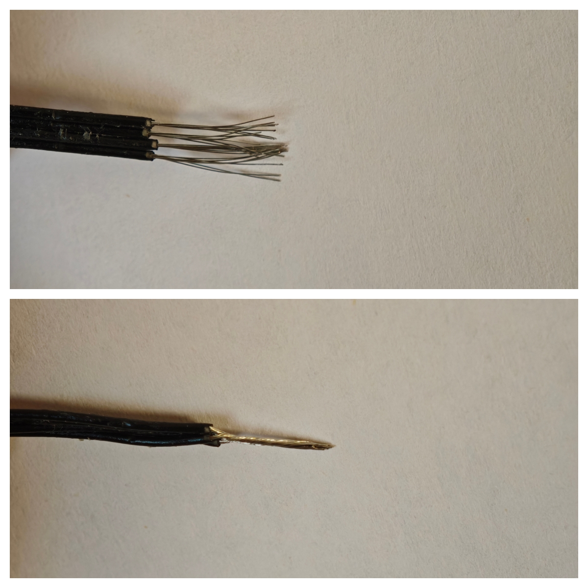
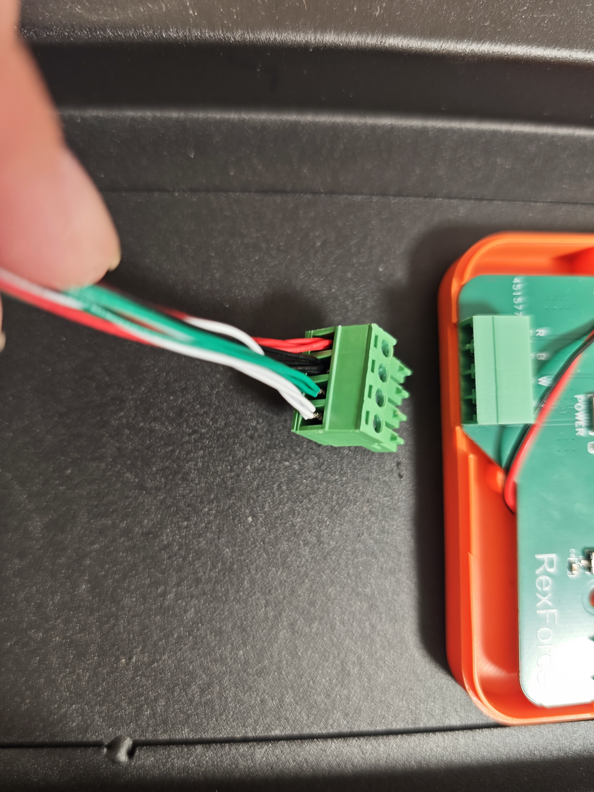
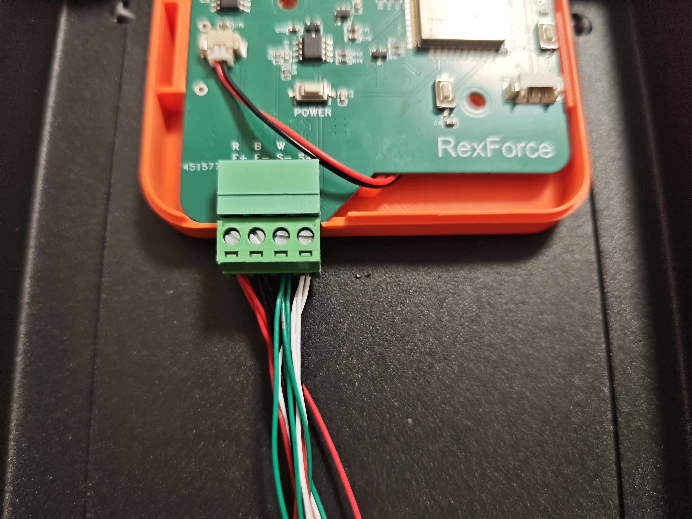
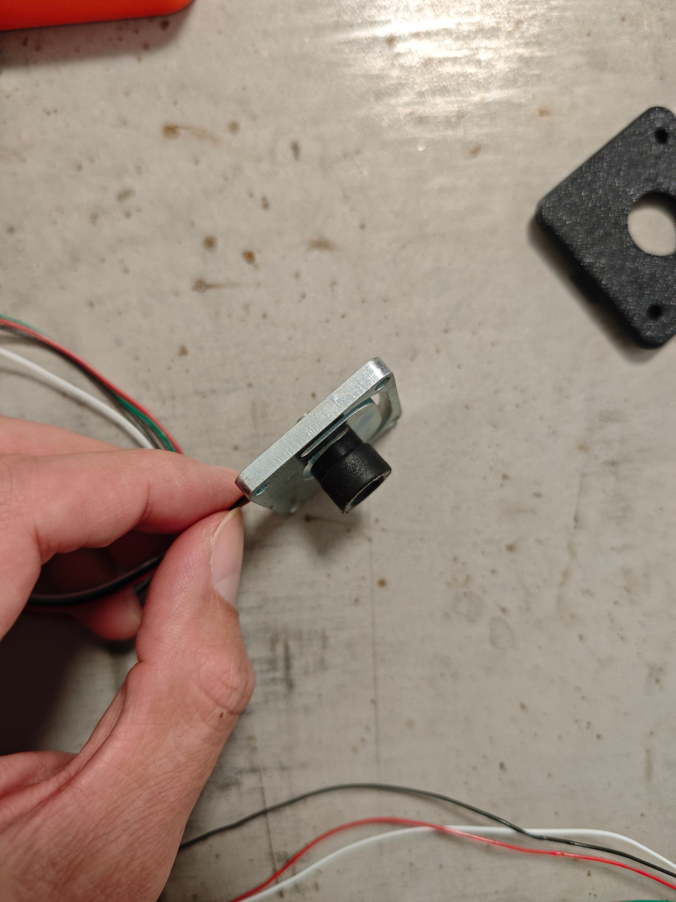

# 基于RexForce主板的测力台装配说明

[点击这里查看RexForce主板开发说明文档](../README.md)

以下是一块测力台的零件，如果要测双脚的，数量×2即可。

## 1 工具

### 1.1 十字螺丝刀、一字螺丝刀

[【淘宝】绿林螺丝刀套装](https://e.tb.cn/h.imDQMPqkdzBjzan?tk=mr7W540cw6q)

### 1.2 鸭嘴剥线钳（可用小刀替代）

[【淘宝】德力西剥线钳](https://e.tb.cn/h.im4mGovcTXpFgY3?tk=erW6540cWMN) 

### 1.3 点胶（方便拆卸，不拆卸可用其他胶或螺丝固定）

[【淘宝】双面胶点胶](https://e.tb.cn/h.imDl7ONvuC2ir8E?tk=Cyh0540WQ5a) 

### 1.4 标准砝码

[ 【淘宝】标准砝码](https://e.tb.cn/h.ioBJtIZrXX8hFKA?tk=fKoD5UCPU7m)

## 2 零件

### 2.1 RexForce测力主板1个

[【淘宝】RexForce测力主板](https://e.tb.cn/h.im4tIFMHybAbLcZ?tk=U6I85407mQf) 

### 2.2 锂电池1个

[【淘宝】3.7V聚合物锂电池](https://e.tb.cn/h.im4aTgAbRC0qc8I?tk=jRqv54Zn69S) 

### 2.3 测力传感器+秤脚

[【淘宝】测力传感器](https://e.tb.cn/h.iJ1PV9ClVYTvE5E?tk=cuvu5ScJeLK) 

 

>单个传感器200kg量程，四个800kg。如果200kg缺货，用100kg的也可以，但要跟客服确认是否至少25cm线长。

### 2.4 外壳3D打印1套

[【淘宝】3D打印服务](https://e.tb.cn/h.inaKN3jBCLKEbqG?tk=2rhw54ZtYiK) 

>联系淘宝客服，将 `.3mf` 文件发给客服，打印即可。可以询问客服自己选颜色和材料。

### 2.5 钢板定制1块

[【淘宝】不锈钢板激光切割](https://e.tb.cn/h.inasCLNXotgxqqC?tk=UrEN54ZE8SY) 

### 2.6 M3螺丝2~20个

[【淘宝】M3黑色不锈钢螺丝](https://e.tb.cn/h.iOpqxURZDhgB21X?tk=pOpC540gd3P) 

### 2.7 接线端子1个

[【淘宝】KF2EDG PCB接线端子](https://e.tb.cn/h.imfXjrMu2owpwlC?tk=r0nq540qWOY) 

  

### 2.8 双头Type-C数据线1根

[【淘宝】双Type-C数据线](https://e.tb.cn/h.iOpiUHw1WF56L72?tk=ZHzF54ZzYl2) 

> 用来连接两个测力台，只有一个测力台可不用数据线。

---

## 3 装配
### 3.1 传感器剥线
用鸭嘴剥线钳或小刀，将所有测力传感器的四根线末端剥出约1cm长的金属线，然后将相同颜色的金属线部分拧到一起，最后按红、黑、白、绿顺序插到接线端子里，用螺丝刀拧紧固定好。

  

  

### 3.2 安装
如图插电池，插接线端子，装外壳。秤脚拧到传感器上，注意加上圆环垫片。

### 3.3 装钢板
如图，四个传感器用胶粘到钢板四个角，如果钢板做了螺丝孔，直接用螺丝拧上最佳。然后将主机固定到钢板底部边缘。

## 4 微信小程序
装配完成后，必须先用精确砝码进行**校准标定**，可以用例程或微信小程序进行校准标定操作。
>详情查看《RexForce测力主板开发说明文档》8. 归零校准操作

开机连接微信小程序《体能训练追踪Lab》，可以进行跳跃测试、等长肌力测试等。

---